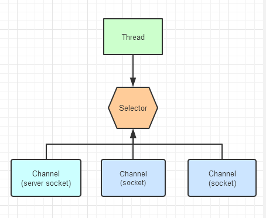
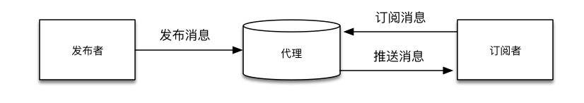
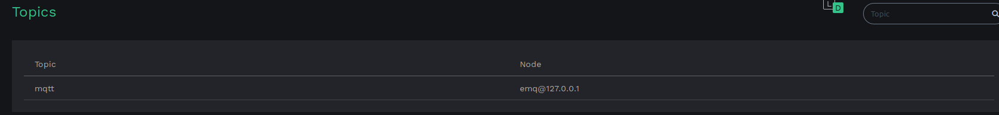
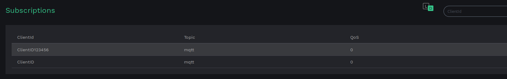
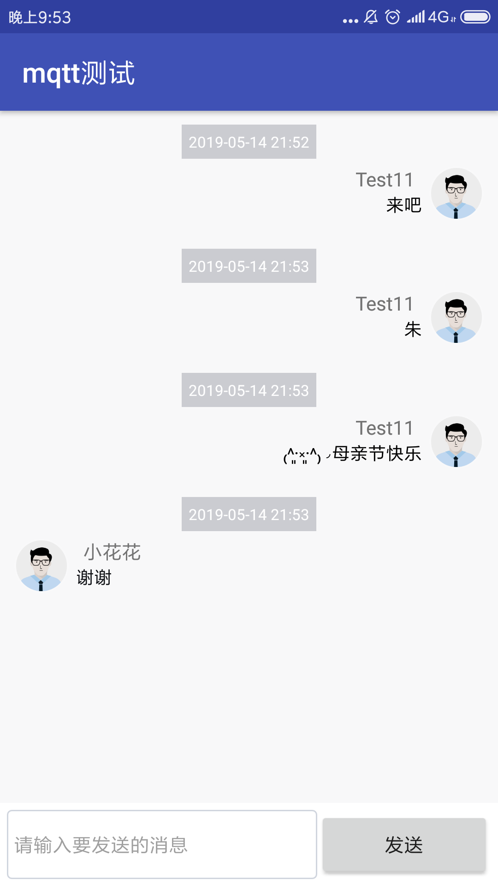

# Mqtt聊天室
#### 想法来源
**一直都想做mqtt协议相关的通信，之前物联网本来想采用mqtt做硬件和服务器通信的，后面又采用的socket通信，所以android就做了一个mqtt协议下的聊天室**
### <font color=red>执行阶段</font>
##### <font face="宋体" size =5>一、常用（Instant Messaging）实现方式及协议的说明</font>**
**Xmqq协议（中封装）:**
一种基于标准通用标记语言的子集XML的协议
XMPP的优点是：协议成熟，强大，可扩展性强，并且有成熟的开源方案。
XMPP的缺点是：信息冗余量大（信息的格式是 XML），因而费流量，费电。

**socket实现（低封装基本没封装）：**
scocket即套接字通信，它不是一种协议，准确说它是一个Tcp/ip协议实现的接口或一个抽象层。
用它可以实现客户端与服务器端的长连接即可实现转发
优点：搭建简单，可以加密，速度快
缺点：对新手不友好，对java底层基础要求高，特别是涉及到多socket通信时。
多socket可以通过selector进行处理，这里还需要在以后进行知识拓展，目前只掌握了单socket通信.

**Http轮询**
这个应该是早期web采用的方式，定时向服务器发送请求实现消息获取。

**Websocket（高封装）:**
基于h5的应用层协议,包含一套标准的 API,可以实现http轮训，ajax轮询等一系列功能，应该是手机端和web端常用的通讯协议（要拓展）。

**Mqtt协议(高封装)**
它工作在 TCP/IP协议族上，是为硬件性能低下的远程设备以及网络状况糟糕的情况下而设计的发布/订阅型消息协议，其实它更适合为硬件提供服务，这里用在android上主要是个人爱好，主要实现流程：


**实现逻辑：**
例：客户端１发布主题"haha"到服务器,其他客户端只要选择订阅"haha"这条主题,就能够相互进行通讯，具体通信逻辑有很多种，详细见mqtt文档.

**讲一下我们项目的情况：**
服务器dashboard:

-----------------------------------------------------------------------


ClientID123456和ClientID这两个用户共同订阅了mqtt这个主题,这两个设备就可以开始通信了


**<font face="宋体" size=5>二、项目介绍</font>**
####1.项目组成：
**planet:**
这是copy别人的，之前用了一个叫soul的app里面的星球元素非常好看，所以就仿照了一个,点击过后就会跳转到聊天室界面，讲一下我理解的实现逻辑。
整个星云图是一个自定义的module,每个星云由很多星球组成，详细可以见
https://github.com/misakuo/3dTagCloudAndroid


**聊天室:**

**项目服务器端采用的是emqtt的一个框架，它支持mqtt,websocket,http等多种协议，还支持redis,mongodb等数据库接口，还有安全接口等.**
搭建步骤省略。

**布局:**
整体布局就是1个recycleView然后自定义adapter,接收消息和发送消息显示的界面不同，怎么做呢？
这里定义了一个Message的实体类,每个消息有与其对应的UserId,我们通过这个进行区分，发送消息时消息里带上自己的UserId,这样通过目前message中的UserId和自己的UserId是否一直来判断是否是他人发出的信息，对应的进行显示就好了。

**Mqtt内部的一些点：**
这个项目里的应用还比较浅显，只是进行了一些方法的重写和理解，可以直接说就是搬运。逻辑大致是这样：
首先通过MqttAsyncClient这里类拿到mqtt实体进行连接
定义一个listener接口，进行逻辑监听

```
public interface MqttListener {
    void onConnected();//连接成功
    void onFail();//连接失败
    void onLost();//丢失连接
    void onReceive(String topic, String message);//接收到消息
    void onSendSucc();//消息发送成功
}
```
每次加载app启动时，就调用subscribe，进行主题订阅，如果发现没有该主题，就进行主题发布，
